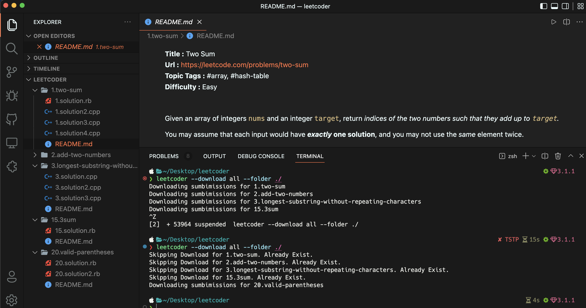

<p align="center">
  
</p>

A Ruby [LeetCode](https://www.leetcode.com) Client to help you download all your accepted leetcode submissions with problem description. LeetCode cookie is used for authentication.

- [Leetcoder](#)
  - [Installation](#installation)
  - [Usage](#usage)
    - [Run Through Docker](#run-through-docker)
    - [Run Through Github Action](#run-through-github-action)
  - [Author](#author)

## Screenshot



## Installation

```bash
gem install leetcoder
```

## Usage

After installing the gem, follow these steps:

 - Sign in to [leetcode.com](www.leetcode.com) from any browser
 - Copy the `cookie` value of a leetcode request using the browser network tab

   

 - Save your cookie by running `leetcoder --cookie` from terminal
 - Run `leetcode --download` to start downloading.

```bash
leetcoder --cookie                    # prompt you to save the leetcode cookie
leetcoder --download all --folder ./  # download all accepted submissions in current folder
```

```bash
> leetcoder --help

Usage: leetcoder [command]

* indicates default value

commands:
    -d, --download [TYPE]            Specify number of accepted submission to download per problem (*one, all)
    -c, --cookie                     Input Leetcode Cookie
    -f, --folder FOLDER_PATH         Specify download folder location (* <current_directory>/leetcode)
    -v, --version                    Show version
    -h, --help                       Show available commands
```

## Run through Github Action

Create a new repository in github and set your leetcode cookie under `Repository Secrets` with name `LEETCODE_COOKIE` in

```text
https://github.com/<username>/<repo_name>/settings/secrets/actions
```

Then, Download and commit this [leetcoder.yml](./leetcoder.yml) file inside `.github/wrokflows/` folder in your repo.

This will automatically download and commit the downloaded submissions every week.
You can customize the frequency using the cron syntax inside the yml file.

This is the most convenient and recommended way to backup your submissions using the app.

## Run through Docker

If you don't have ruby setup locally, you can run the app through docker.

First, open terminal and cd to the directory where you want to download the submissions.

Then run,

```bash
docker run -it -v `pwd`:`pwd` -w `pwd` imamrb/leetcoder:latest
```

This will run the [leetcoder docker image](https://hub.docker.com/repository/docker/imamrb/leetcoder) and mount your current directory to container working directory. You can now continue using the app from here.

The downloaded submissions will be saved to your current directory.

Caveat: You will need to provide the leetcode cookie every time since the stored configuration will be lost when you exit from the container.

## Author

Imam Hossain <br>
Email: imam.swe@gmail.com
